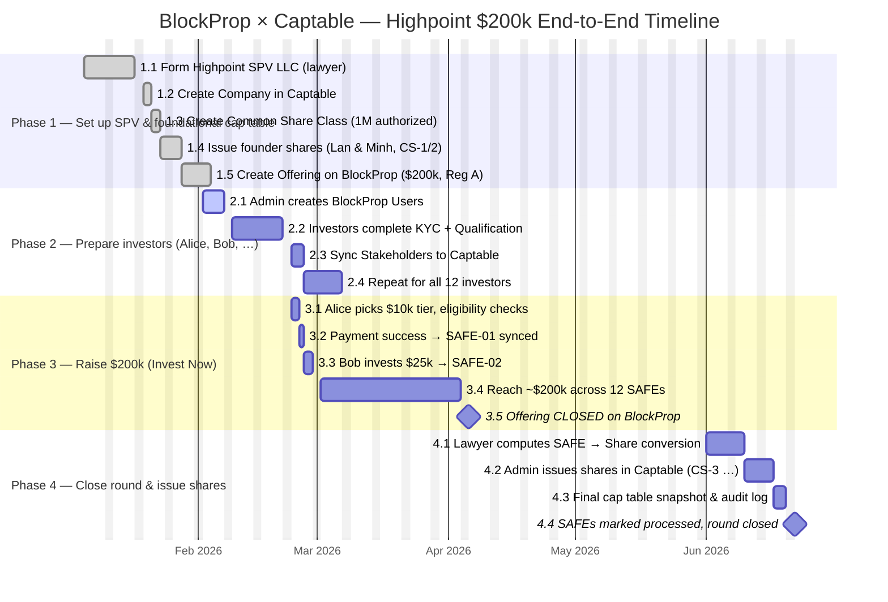

# Domain Knowledge: Cap Table, Fundraising & BlockProp × Captable Integration

Onboarding document for newcomers — a consolidated overview of concepts, roles, operational flows, and the mapping between the investor-facing product (BlockProp) and the back-office (Captable).

---

## 1. The Big Picture

### 1.1 Two System Layers

| Layer         | Example               | Responsibility                                                            |
| ------------- | --------------------- | ------------------------------------------------------------------------- |
| Front-office  | BlockProp (design)    | Social network, offerings, investment tiers, KYC, payments, Reg A/D       |
| Back-office   | Captable (reference)  | Cap table, stakeholders, SAFEs, shares, eSign, audit, RBAC                |

**Flow:** Investor → BlockProp (Invest Now, community) → API / webhook (after KYC + payment) → Captable (Stakeholder, SAFE, Share, audit).

### 1.2 Example Company

- **BlockProp** — a platform for fractionalizing real estate.
- **Highpoint Commerce Center** — a sample offering (a warehouse project in Florida), example target of **$200k**, tiers **$5k – $25k**, minimum **$500**.

---

## 2. Actors and Roles

| Concept                  | Who are they?                                          | Logs in? | In Captable        | In BlockProp                |
| ------------------------ | ------------------------------------------------------ | -------- | ------------------ | --------------------------- |
| **User**                 | A system account                                       | Yes      | User               | User (created by admin)     |
| **Member**               | A user inside a company with administrative rights     | Yes      | Member + RBAC      | Ops / issuer / admin        |
| **Stakeholder**          | A person on the cap table (investor, founder, ...)     | Optional | Stakeholder        | Investor after KYC          |
| **Investor (BlockProp)** | A user with the `invest` role                          | Yes (BlockProp) | Usually = Stakeholder | User + KYC          |

**Golden rules:**

- **User ≠ Stakeholder** (no automatic 1-to-1 mapping).
- An investor on the cap table = a **Stakeholder**; the app login = a **User** (may share the same email, but they are two separate records).
- Admin / team members = **User + Member**; they do **not** need to be a Stakeholder.

---

## 3. Core Concept Dictionary

### 3.1 Cap Table (Ownership Ledger)

**What is it?**
A cap table (capitalization table) is a consolidated table that shows: how many shares (or rights convertible into shares) a company has, who holds how many, and what percentage of ownership that represents.

It answers three questions:

- Who are the shareholders / holders of equity rights?
- How many shares do they own (or what percentage will their SAFE convert into later)?
- If the company is sold / pays out / raises more capital, who gets paid first and who gets paid later?

**A simple example**

A company with 10 million Common shares:

| Holder       | Shares      | %    |
| ------------ | ----------- | ---- |
| Founder A    | 4,000,000   | 40%  |
| Founder B    | 4,000,000   | 40%  |
| Investor C   | 2,000,000   | 20%  |
| **Total**    | 10,000,000  | 100% |

That is a cap table in its most basic form.

**In reality it is more complex**

A cap table also records:

- Multiple share classes (Common, Preferred Series A, B, ...).
- SAFEs / options that have not yet converted (shown on a "fully diluted" basis — i.e. how the percentages would change if everything converted).
- Vesting (a founder may be "promised" 4M shares but have only vested 25% so far).

**Captable vs BlockProp**

| System                            | Role                                                                |
| --------------------------------- | ------------------------------------------------------------------- |
| Captable                          | Stores the source of truth: stakeholders, shares, SAFEs, share classes |
| Cap table page inside the app     | Aggregated table view — currently **WIP** (not yet finished)        |
| BlockProp                         | Investors see their portfolio / projects; full cap table usually lives in the back-office |

**In short:** the cap table is the equity ownership ledger; **Captable** is the bookkeeping tool, **BlockProp** is the investor-facing storefront.

### 3.2 Company

**What is it?**
In Captable, a **Company** is a legal entity managed inside the system: a startup, a parent company, or an SPV (Special Purpose Vehicle — a company set up specifically to hold a single asset / project).

Everything "belonging to that company" carries a `companyId`:

- Stakeholders
- Share classes
- SAFEs, Shares
- Documents, eSign
- Members (the admin team)

**BlockProp / real-estate example**

| Organization style                       | Company in Captable                                                |
| ---------------------------------------- | ------------------------------------------------------------------ |
| BlockProp is a startup                   | 1 Company = BlockProp Inc.                                          |
| Each real-estate project is its own SPV  | 1 Company = Highpoint SPV LLC<br>1 Company = another Florida SPV   |

Highpoint Commerce Center in the BlockProp UI typically maps to one SPV → one Company in Captable. Highpoint's cap table only contains the shareholders / investors of that SPV, separate from any other company.

**Common confusions**

- Company ≠ **Offering** (an offering is a "sale / fundraising campaign" inside BlockProp).
- Company ≠ **User** (a user logs into the app; a company is a legal entity).

### 3.3 Stakeholder

**What is it?**
A **Stakeholder** = the profile of a person or organization related to a company's equity: investor, founder, employee with options, advisor, ...

This is the address book on the cap table, **not a login account** (unless you deliberately link them).

Typical information:

- Name, email
- `INDIVIDUAL` (a person) or `INSTITUTION` (a fund, a company)
- Relationship: `INVESTOR`, `FOUNDER`, `EMPLOYEE`, `ADVISOR`, ...

**What does a stakeholder "carry"?**

A single stakeholder may have multiple child records:

```
Alice (Stakeholder, INVESTOR)
├── SAFE-01: $10,000
├── SAFE-02: $15,000  (different project, same company)
└── Share CS-3: 50,000 Common shares (after conversion)
```

→ One person, many transactions — do **not** create a new stakeholder every time they invest.

**Difference from User / Member**

|                  | Stakeholder           | User + Member        |
| ---------------- | --------------------- | -------------------- |
| Purpose          | Recorded in cap table | App administration   |
| Investor Alice   | Yes                   | Usually not          |
| CEO Minh         | Yes (if founder)      | Yes                  |

In BlockProp the admin creates a `User` for Alice; after KYC, a `Stakeholder` with the same email is synced — they remain two records in two layers.

**Technical note**
The stakeholder `email` is currently unique across the entire database. If Alice invests in two SPVs (two Companies), the same email may be rejected — this should be changed to be unique per `(companyId, email)`.

### 3.4 Share Class (Common / Preferred)

**What is it?**
A **Share class** is a type of stock defined ahead of time by the company in its charter, **before** any shares are issued to anyone.

Like ticket tiers in a theater:

- Standard (Common): basic rights
- VIP (Preferred): priority, additional rights

A share class answers: *"What types of shares does the company have, how many of each at most, with what rights?"* — it does **not** answer *"How many shares does Alice own?"*.

**Common vs Preferred (in practice)**

|                                | COMMON                                            | PREFERRED                              |
| ------------------------------ | ------------------------------------------------- | -------------------------------------- |
| Typical holders                | Founders, employees, retail                       | VCs, funds                             |
| When the company sells / fails | Paid after preferred                              | Paid first (liquidation preference)    |
| Captable prefix                | `CS`                                              | `PS`                                   |
| Price per share                | Usually very low (founders) or per retail pricing | Set by Series A/B round valuation      |

**`initialSharesAuthorized`**
= the legal cap: the maximum number of shares of this class that may be issued.

Example: Common authorized for 10,000,000 shares — this does **not** mean "we need to raise $200k" or "we need 20 investors". It is a share ceiling, not a money target for a BlockProp offering.

**Who defines it?**

- The **Issuer** (company + lawyer) → an admin enters it in Captable's *Share classes*.
- An investor on BlockProp does **not** pick Common / Preferred when clicking the $5k–$25k tier — the issuer already decided: every retail tier usually maps to the same class (e.g. SPV Common).

**Common confusions**

| Wrong                                       | Right                                          |
| ------------------------------------------- | ---------------------------------------------- |
| Tier $10k = Share class "10k"               | Tier = an amount of money; class = a legal share type |
| Create a new class for every investor       | Issue new shares, all under the same class     |

### 3.5 Issue Share

**What is it?**
**Issue share** = a single grant of real shares to a stakeholder: the shares now exist on the cap table, with a quantity, certificate, date, and contribution amount (if any).

Logical formula:

```
Issue Share = Stakeholder + Share Class + quantity + certificateId + (money, date, vesting, ...)
```

**Example**
Highpoint SPV has share class `Common` with a reference price of $1 / share:

- Alice contributes $10,000 → issue 10,000 Common shares, certificate `CS-1`.
- Bob contributes $25,000 → issue 25,000 Common shares, certificate `CS-2`.

Two issuances, one share class.

**Difference from SAFE**

|                       | SAFE                            | Issue Share          |
| --------------------- | ------------------------------- | -------------------- |
| Shares right now?     | No                              | Yes                  |
| Counts in cap table % | Not yet (or shown separately)   | Yes                  |
| Requires Share Class? | No                              | Yes                  |

**In Captable**
Menu: `Securities → Shares → Create a share` (wizard: class, stakeholder, quantity, certificate, date, vesting, documents).

### 3.6 SAFE

**What is it?**
**SAFE** = **Simple Agreement for Future Equity** — a contractual commitment: an investor sends money today in exchange for the right to receive shares in the future when there is a priced round (or another conversion event), under the agreed terms.

It is **not** equity at signing — so the cap table's "ownership %" is not yet fixed.

**Typical fields in a SAFE**

| Field           | Meaning                                                |
| --------------- | ------------------------------------------------------ |
| `capital`       | Amount invested ($10k, $100k, ...)                     |
| `valuation cap` | Valuation ceiling at conversion — protects the investor|
| `discount`      | Discount on the share price at conversion              |
| `template`      | YC template (post-money cap, MFN, ...)                 |

**What does it link to in the DB?**

- Stakeholder (who contributed)
- Company (which company)
- **Not** a Share Class (since the class and quantity are not yet known)

**When is it used (BlockProp / startup)?**

- Early stage, when the company doesn't want / need to issue shares yet.
- Reg A may use a similar "commit first, shares later" structure depending on legal counsel.
- Each `Invest Now` action may sync to → 1 new SAFE (`capital` = tier amount).

**Converting later**
A lawyer calculates: SAFE of $100k → 125,000 Common shares. An admin then issues those shares manually in Captable — the app does **not** auto-convert SAFE → Share.

### 3.7 Vesting

**What is it?**
**Vesting** = shares (or stock options) do not all belong to you immediately; they "unlock" over time as you stay at / work for the company.

Purpose: retain founders / employees — leaving early forfeits the unvested portion.

**Example: 4 years, 1-year cliff**

- Year 0–1: 0% (cliff)
- End of year 1: ~25% vested
- Years 2–4: gradually more each month / quarter
- Leaving mid-way: you only keep what has already vested

In Captable: `vestingYears`, `cliffYears`, `vestingStartDate` on a Share or Option.

**Who has vesting?**

| Who                                              | Vesting?                              |
| ------------------------------------------------ | ------------------------------------- |
| Founders, employees (shares / options)           | Usually yes                           |
| Retail Reg A investors (BlockProp $ tier)        | Usually no (`vestingYears = 0`)       |

An investor paying $10k receives ownership rights / SPV shares — they are not "waiting 4 years for their share" the way founders are.

### 3.8 Offering (BlockProp)

**What is it?**
An **Offering** = an investment opportunity / campaign on BlockProp: a specific project with a description, capital goal, minimum, tiers, exemption (Reg A, ...).

**Example UI:** Highpoint Commerce Center

- Target: **$200,000**
- Min: **$500**
- Tier: **$5k, $10k, ..., $25k**
- Tags: **Investments, Community**

**Offering ≠ Share Class**

| Offering                              | Share Class                             |
| ------------------------------------- | --------------------------------------- |
| "This project is raising capital now" | "The SPV has a Common share class"      |
| Visible to investors in the app       | Configured by an admin in Captable      |
| Tier = an amount of money             | A share type + the rights attached      |

**Captable today**
There is **no Offering model** yet — the `Fundraise → Investments` menu is WIP. Offering + tier + progress bar belong to BlockProp; they sync to Captable as `Stakeholder + SAFE/Share + metadata (offeringId)`.

**Flow**
Highpoint Offering (BlockProp):

1. → 20 people × $10k = $200k
2. → 20 SAFEs (or 20 issued shares) in Captable
3. → 1 Common Share Class on the SPV (defined ahead of time)

### 3.9 KYC

**What is it?**
**KYC (Know Your Customer)** = verifying an investor's identity: is this a real person, are they on a PEP / sanctions list, does the information match — to satisfy AML and broker-dealer / exemption requirements.

**Which system owns it?**
**BlockProp** — Captable does not have a built-in KYC module.

**Recommended order**

1. Admin creates a BlockProp `User` (Alice).
2. Alice submits KYC → approved / rejected.
3. KYC `APPROVED` → create a Stakeholder in Captable.
4. Alice can click `Invest Now`.
5. Payment succeeds → SAFE / Share is created.

KYC happens **before** investing — do not collect money and verify afterwards (unless legal counsel allows a very limited intermediate step).

**KYC data vs Stakeholder**
KYC may populate the Stakeholder's `name`, `address` on sync — but the KYC **status** (pending / approved) should stay in BlockProp, **not** be flattened into a flag on the Captable Stakeholder.

### 3.10 RBAC

**What is it?**
**RBAC (Role-Based Access Control)** = permissions by role: a user belongs to a company team with some role, and that role determines what they can do in each module.

This applies only to **Users** logging into the Captable dashboard (i.e. Members) — it does **not** apply to Stakeholders / investors.

**Captable structure**

- **Subjects (modules):** `stakeholder`, `documents`, `members`, `roles`, `audits`, `company`, `billing`, ...
- **Actions:** `create`, `read`, `update`, `delete`, or `*` (all)
- **Roles:**
  - `ADMIN` — full access to every subject
  - `CUSTOM` — an admin creates a custom role and assigns a permission JSON

**Example role "Legal":** `documents: *`, `stakeholder: read` — cannot delete members or touch billing.

**Real example**

| Person          | Captable RBAC                              |
| --------------- | ------------------------------------------ |
| CEO             | `ADMIN`                                    |
| Accountant      | Read-only on stakeholder, documents        |
| Alice (investor)| None — they do not enter the dashboard     |

BlockProp will have its own RBAC (who can publish an offering, who approves KYC); Captable's RBAC only protects the back-office cap table.

**Quick-reference layering diagram**

```
Company (SPV Highpoint)
│
├── Share Class "Common"        ← defines the share type (issuer)
│
├── Stakeholder Alice           ← investor profile (after KYC)
│   ├── SAFE $10k               ← commitment (before / instead of shares)
│   └── Share 10k of CS-1       ← real shares (after issuance)
│
├── Offering (BlockProp)        ← campaign raising $200k, tier $
│   └── Invest → sync SAFE / Share
│
└── Member (CEO) + RBAC         ← admin team, not an investor
```

---

## 4. Relationships Between Concepts

- A **Company** has many **Stakeholders**, **ShareClasses**, **Safes**, **Shares**.
- **User** → **Member** → **Company** (RBAC).
- A **Stakeholder** → many **Safes** / **Shares**.
- **Share** = **Stakeholder** + **ShareClass**.
- A **Safe** only links to a **Stakeholder** (no Share Class).
- A BlockProp **Offering** maps to a **Company / SPV**; an `InvestmentOrder` syncs into a **Safe / Share**.

---

## 5. End-to-End Example: Highpoint $200k

Assumption: **Highpoint Commerce Center** (a Florida warehouse) is raising **$200,000** under **Reg A Tier 2**, with tiers `$5k / $10k / $15k / $20k / $25k`, minimum `$500`. Each project = 1 SPV = 1 Company in Captable.

**Cast of characters**

| Person       | Real-world role                      | BlockProp                  | Captable                              |
| ------------ | ------------------------------------ | -------------------------- | ------------------------------------- |
| Minh         | CEO / operator of the platform & SPV | Admin (creates users, approves KYC) | User + Member `ADMIN`        |
| Lan          | BlockProp co-founder (founder shares)| —                          | Stakeholder `FOUNDER`                 |
| Alice        | Retail angel                         | User (created by admin)    | Stakeholder `INVESTOR` (after KYC)    |
| Bob          | Retail angel                         | User                       | Stakeholder `INVESTOR`                |
| Carol, Dan,…  | 18 other investors                  | User                       | Stakeholder                           |

### Phase 1 — Set up the SPV & foundational cap table

**Month 1.** Minh + lawyer. No retail investors yet.

#### Step 1.1 — Form the SPV (outside the app)

The lawyer files **Highpoint SPV LLC** (Delaware or another state) for the sole purpose of holding the Highpoint warehouse.

An **SPV** is a company (LLC or corporation) created specifically to hold and operate a single asset or project — kept separate from the parent / platform.

#### Step 1.2 — Create the Company in Captable

Who does it: Minh (logged in as `ceo@example.com`).
Menu: `Onboarding / company` (or already seeded).

DB result:

```yaml
Company:
  id: company_highpoint
  name: "Highpoint Commerce Center SPV LLC"
  publicId: "hp7x2k9..."
```

#### Step 1.3 — Create the Common Share Class

Captable menu: `Share classes → Create a share class`.

> **Common** = the "everyman" share in the company — anyone can hold it (founders, employees, retail investors), with basic rights, paid after preferred shares if something bad happens, but gaining a lot if the company succeeds.

| Field                       | Value                                                                  |
| --------------------------- | ---------------------------------------------------------------------- |
| Name                        | Common Stock                                                           |
| Class type                  | `COMMON`                                                               |
| Initial shares authorized   | 1,000,000                                                              |
| Votes per share             | 1                                                                      |
| Par value                   | 0.0001                                                                 |
| Price per share             | 1.00 (reference price for future retail issuances)                     |

DB result:

```yaml
ShareClass:
  id: sc_common_hp
  companyId: company_highpoint
  classType: COMMON
  prefix: CS
  initialSharesAuthorized: 1_000_000
```

→ Nobody owns any shares yet. We have only declared that "the SPV has a Common share class, capped at 1M shares".

#### Step 1.4 — Issue shares to the founder (Lan)

Menu: `Securities → Shares → Create a share`.

| Field         | Value                                                |
| ------------- | ---------------------------------------------------- |
| Stakeholder   | Lan (create first as `FOUNDER` if not yet present)   |
| Share class   | Common Stock                                         |
| Certificate   | CS-1                                                 |
| Quantity      | 400,000                                              |
| Vesting       | 4 years, 1-year cliff                                |
| Status        | `ACTIVE`                                             |

Minh (the second founder) is similar: `CS-2`, 400,000 Common shares.

Cap table after this step:

| Person                | Common shares          | % (of the 800k issued) |
| --------------------- | ---------------------- | ---------------------- |
| Lan                   | 400,000                | 50%                    |
| Minh                  | 400,000                | 50%                    |
| Remaining authorized  | 200,000 not yet issued | —                      |

(Founder share counts are illustrative — in practice the charter decides.)

#### Step 1.5 — Create the Offering on BlockProp

Who does it: Minh (BlockProp admin).
Not in Captable — built in BlockProp:

```yaml
Offering:
  id: offering_highpoint
  title: "Highpoint Commerce Center"
  companyId / spvId: company_highpoint
  exemption: REG_A_TIER2
  targetAmount: 200_000
  minTicket: 500
  tiers: [5000, 10000, 15000, 20000, 25000]
  status: OPEN
```

The Offer page shows the real-estate description; the Invest page shows the 5 tiers and an `Invest Now` button.

At this point: no SAFEs, no investors on the SPV cap table (other than founders).

### Phase 2 — Prepare investors (Alice, Bob)

**Month 2.** Admin-driven: users are created by the admin.

#### Step 2.1 — Admin creates a BlockProp User for Alice

Who: Minh.

```yaml
BlockProp User:
  id: user_alice
  email: alice@example.com
  role: INVESTOR
  kycStatus: PENDING
```

Alice receives email / password, logs in, but cannot `Invest Now` yet.

#### Step 2.2 — Alice completes KYC

Alice uploads an ID, address, and answers income / asset questions (Reg A).
Compliance reviews:

```yaml
KycRecord:
  userId: user_alice
  status: APPROVED

InvestorQualification:
  userId: user_alice
  exemption: REG_A_TIER2
  status: ELIGIBLE
  regAMaxAmount: 25_000   # e.g. remaining Reg A cap
  isAccredited: false

InvestorQualification:
  userId: user_alice
  exemption: REG_D_506C
  status: INELIGIBLE
```

#### Step 2.3 — Sync the Stakeholder into Captable

Trigger: KYC `APPROVED` (webhook / job).
Captable API (or admin manually via `Stakeholders → Add`):

```yaml
Stakeholder:
  id: sh_alice
  companyId: company_highpoint
  name: "Alice Nguyen"
  email: alice@example.com
  stakeholderType: INDIVIDUAL
  currentRelationship: INVESTOR
```

Note: Alice is **not** a Captable `Member` — only a Stakeholder.

#### Step 2.4 — Repeat for Bob

Same path: User → KYC → Stakeholder `sh_bob`.

### Phase 3 — Raise $200k (`Invest Now`)

**Months 2–3.** Alice / Bob click `Invest` on BlockProp.

#### Step 3.1 — Alice picks the $10,000 tier

BlockProp UI: Highpoint → `Invest Now` → `$10,000`.

The system checks:

- KYC approved? Yes
- Offering exemption = Reg A → is Reg A qualification `ELIGIBLE`? Yes
- $10,000 ≤ `regAMaxAmount`? Yes
- Does the offering still have room (collected so far + 10k ≤ $200k)? Yes

→ Hands off to payment (ACH / card / wire — outside the Captable scope).

#### Step 3.2 — Payment succeeds → record everything

BlockProp:

```yaml
InvestmentOrder:
  id: order_001
  offeringId: offering_highpoint
  userId: user_alice
  stakeholderId: sh_alice   # link into Captable
  amount: 10_000
  tier: 10000
  exemption: REG_A_TIER2
  status: PAID
```

Sync into Captable (SAFE — since shares aren't issued yet):

```yaml
Safe:
  id: safe_01
  publicId: SAFE-01
  companyId: company_highpoint
  stakeholderId: sh_alice
  capital: 10_000
  status: ACTIVE
  valuationCap: ...           # from the offering term sheet
  safeTemplate: POST_MONEY_CAP
  issueDate: 2026-03-15
  # (extension) offeringExternalId: offering_highpoint
  # (extension) complianceRef: order_001
```

eSign (optional): `Documents → SAFE template → Alice signs`.

Offering progress: **$10,000 / $200,000 = 5%**.

#### Step 3.3 — Bob invests $25,000

Same flow:

- `InvestmentOrder` `order_002` → `Safe SAFE-02`, capital `25_000`, stakeholder `sh_bob`.
- Progress: `35_000 / 200_000 = 17.5%`.

#### Step 3.4 — Reach ~$200k (e.g. 12 investors)

| #  | Investor | Tier  | SAFE     | Capital | Cumulative |
| -- | -------- | ----- | -------- | ------- | ---------- |
| 1  | Alice    | $10k  | SAFE-01  | 10,000  | 10,000     |
| 2  | Bob      | $25k  | SAFE-02  | 25,000  | 35,000     |
| 3  | Carol    | $10k  | SAFE-03  | 10,000  | 45,000     |
| 4  | Dan      | $15k  | SAFE-04  | 15,000  | 60,000     |
| 5  | Eve      | $20k  | SAFE-05  | 20,000  | 80,000     |
| …  | …        | …     | …        | …       | …          |
| 12 | Larry    | $25k  | SAFE-12  | 25,000  | 200,000    |

Captable `Fundraise → SAFEs`: 12 SAFE rows, 12 stakeholders (or fewer if one person invests twice → two SAFEs against the same stakeholder).

BlockProp offering `status: CLOSED` (target reached).

"Real shares" on the cap table at this point: still only founders (Lan, Minh). The 12 investors hold SAFEs and do not yet have an official ownership %.

### Phase 4 — Close the round & issue shares (convert SAFE → Share)

**Month 6.** Lawyer + Minh. The SPV buys the asset and issues shares to the investor pool.

#### Step 4.1 — Lawyer computes the conversion

Assume the SPV is priced at $1 / Common share, and the investor pool of $200k → 200,000 shares spread across the 12 SAFEs (simplified).

| SAFE          | Capital  | Shares after conversion |
| ------------- | -------- | ------------------------ |
| SAFE-01 Alice | $10,000  | 10,000                   |
| SAFE-02 Bob   | $25,000  | 25,000                   |
| …             | …        | …                        |

#### Step 4.2 — Issue Shares in Captable (manual today)

Menu: `Securities → Shares → Create`.

Alice:

| Field                | Value         |
| -------------------- | ------------- |
| Stakeholder          | Alice         |
| Share class          | Common Stock  |
| Certificate          | CS-3          |
| Quantity             | 10,000        |
| Capital contribution | 10,000        |
| Vesting              | 0             |
| Status               | `ACTIVE`      |

Repeat for Bob (`CS-4`, 25,000 shares), and so on.

#### Step 4.3 — Cap table after conversion (example)

Assume the total issued shares are:

| Person       | Type           | Shares    | Notes              |
| ------------ | -------------- | --------- | ------------------ |
| Lan          | Common CS-1    | 400,000   | Founder, vesting   |
| Minh         | Common CS-2    | 400,000   | Founder, vesting   |
| Alice        | Common CS-3    | 10,000    | From SAFE-01       |
| Bob          | Common CS-4    | 25,000    | From SAFE-02       |
| … 10 others  | Common         | 165,000   |                    |
| **Total**    |                | 1,000,000 | Authorized cap reached |

Alice's stake: `10,000 / 1,000,000 = 1%` (simple fully diluted).

- The SAFE can remain `ACTIVE` or be marked as "processed" — depending on internal process.

#### Appendix: Alice invests in two projects

**Case A — Same SPV / same Company (rare)**
If Highpoint and "Florida Warehouse II" share `company_highpoint`:

```
Stakeholder sh_alice (single record)
├── SAFE-01 Highpoint    $10k
└── SAFE-13 Florida II   $15k
```

→ 1 Stakeholder, 2 SAFEs.

**Case B — Each project is its own SPV (real-estate reality)**

*Project 1 — Highpoint*

- Company: `company_highpoint`
- Stakeholder: `sh_alice_hp` (`alice@example.com`, INVESTOR)
- Safe `SAFE-01`: $10k

*Project 2 — Tampa Logistics Park*

- Company: `company_tampa`
- Stakeholder: `sh_alice_tampa` (`alice@example.com`, INVESTOR) ← same email, different company
- Safe `SAFE-01`: $15k

→ 2 Companies, 2 Stakeholders (same person, 2 SPVs).

BlockProp: 1 User Alice, 2 InvestmentOrders.

Captable today: `email` is `@unique` across the whole DB → it needs to be changed to `@@unique([companyId, email])` before a second stakeholder with the same email can be created.

#### Who does what — one-page checklist

| Step | Minh (admin)                              | Alice (investor)        | Captable                          | BlockProp                |
| ---- | ----------------------------------------- | ----------------------- | --------------------------------- | ------------------------ |
| 0    | Create Company, Share Class, issue founders | —                     | Yes                               | Create Offering          |
| 1    | Create User Alice                         | KYC                     | Stakeholder + KYC + Qualification |                          |
| 2    | —                                         | Invest $10k, pays       | SAFE-01                           | Order `PAID`             |
| 2b   | Tracks progress to $200k                  | …                       | 12 SAFEs                          | Offering `CLOSED`        |
| 3    | Issue shares per the lawyer's calc        |                         | Share `CS-3` …                    | (optional) portfolio update |

#### Money flow & data flow (summary)

```
Money: Alice $10k
→ Bank / escrow (BlockProp payment)
→ Highpoint SPV receives the capital (outside the app)

Data:
  BlockProp:   User → KYC → Order $10k
  Captable:    Stakeholder → SAFE $10k
  (later):     Stakeholder → Share 10,000 Common
```

#### Common confusions in this example

- `$200k target` ≠ `initialSharesAuthorized = 1M` — one is a money goal, the other is a legal share ceiling.
- Tier `$10k` ≠ Share class — Alice and Carol on the same tier still share the same Common class but with different amounts.
- 12 SAFEs ≠ 12 Stakeholders — could be 12 people × 1 SAFE, or fewer people × multiple SAFEs.
- Investing ≠ owning shares immediately — Phase 2 only produces SAFEs; shares come in Phase 3 (issue).
- Alice the BlockProp User ≠ Alice the Captable Member — investors do not need admin permissions.

---

## 6. BlockProp UI → Captable Mapping

| BlockProp UI         | Captable                          |
| -------------------- | --------------------------------- |
| Community / posts    | Build from scratch                |
| Offer page           | Offering metadata                 |
| Tier $5k–$25k        | `SAFE.capital` / Share            |
| Invest Now           | SAFE or Issue Share               |
| KYC                  | BlockProp DB                      |
| Portfolio            | Aggregated SAFE / Share           |

---

## 7. Decision Flow

- **SAFE:** no shares yet, commitment to convert later.
- **Issue Share:** real shares, priced round, SPV closed.
- **Captable order:** Stakeholder → Share Class → Issue Share; or Stakeholder → SAFE.
- **BlockProp order:** User → KYC → Stakeholder → Invest + payment → SAFE / Share.

---

## 8. Captable Modules

| Module                                                         | Status           |
| -------------------------------------------------------------- | ---------------- |
| Stakeholders, Share classes, Shares, SAFEs, eSign, RBAC        | Available        |
| Cap table view, Investments                                    | WIP              |
| Offering, KYC, Reg A/D                                         | BlockProp        |

Dev login: `ceo@example.com` / `P@ssw0rd!` (after seeding).

---

## 9. Suggested BlockProp Extensions

- **BlockProp:** `Offering`, `InvestmentTier`, `InvestmentOrder`, `InvestorQualification`, `KycRecord`.
- **Sync to Captable:** `Stakeholder`, `Safe / Share`, optional exemption snapshot.
- **Captable changes:** `@@unique([companyId, email])`, `offeringExternalId` on `Safe`.

---

## 10. Review Table

| Concept       | One-liner                                |
| ------------- | ---------------------------------------- |
| User          | A login account                          |
| Member        | A user inside a company + RBAC           |
| Stakeholder   | A person on the cap table                |
| Share Class   | A share type (Common / Preferred)        |
| Issue Share   | Issuing real shares                      |
| SAFE          | Money committed, no shares yet           |
| Vesting       | Shares unlock over time                  |
| Offering      | A fundraising project (BlockProp)        |
| Tier $        | An invest-amount bucket                  |
| KYC           | Identity verification before investing   |
| Reg A / D     | Exemption — who may buy                  |
| RBAC          | Permissions for the admin team           |

---

## 11. Common Mistakes

1. Treating `User = Stakeholder`.
2. Treating `Tier $ = Share Class`.
3. Treating `$200k target = initialSharesAuthorized`.
4. Creating a new stakeholder for every investment.
5. Doing KYC **after** taking money.
6. Reducing Reg A / D to a single boolean on a Stakeholder.
7. Requiring investors to have Captable RBAC.

This document reflects the existing Captable + the BlockProp design that has been discussed. **Have legal counsel review before any production rollout.**

---

## References

| Topic                  | Location                                      | Notes / mapping with BlockProp                                                |
| ---------------------- | --------------------------------------------- | ----------------------------------------------------------------------------- |
| SAFE data model        | `prisma/`                                     | The Prisma model maps onto BlockProp                                          |
| Original YC SAFE PDFs  | `public/yc/`                                  | Canonical YC PDF files, ready to use                                          |
| Stakeholder model      | `prisma/schema.prisma:277`                    | Has the right investor fields (name, email, institution, type); similar to `User` (consider updating this table) |
| Share / ShareClass     | `prisma/schema.prisma:340`                    | Common / Preferred matches the requirement in section 6                       |
| Vesting logic          | `prisma/schema.prisma:693`                    | `cliffYears`, `vestingYears`, `vestingStartDate` — adaptable for tokens       |
| Audit model            | `prisma/schema.prisma:309`                    | Well-structured; use as an immutable ownership log                            |
| RBAC structure         | `prisma/schema.prisma:243`                    | `CustomRole` + permissions JSON — extend with an investor role                |

### Third-party services to use

| Need                  | Service                       | Reason                                                                                                  |
| --------------------- | ----------------------------- | ------------------------------------------------------------------------------------------------------- |
| eSign                 | DocuSign or HelloSign API     | Legal validity for SEC agreements. Building this in-house is legally risky; needs deeper discussion later |
| KYC / AML             | Already available per requirements | Out of scope, assumed existing                                                                     |
| Crypto wallet connect | WalletConnect / RainbowKit    | Standard Web3 wallet integration                                                                        |
| Token issuance on-chain | Smart contract on the chain BlockProp picks | Requires careful research                                                                 |
| Geo-IP                | MaxMind or `ip-api.com`       | For audit-trail location, simple API call                                                               |

### To build from scratch

| Component                  | Complexity | Notes                                                                                  |
| -------------------------- | ---------- | -------------------------------------------------------------------------------------- |
| Token model + SAFE + T     | High       | Must track total allocation, vested, locked, cliff — none of which exist in Captable    |
| Exemption classification   | Low        | Add an `exemptionType` enum (Reg A / Reg D / Reg CF) to `offering` and `SAFE`           |
| Investor portfolio view    | Medium     | Read-only UI: equity + SAFE + token holdings + vesting schedule                         |
| Ledger automation          | High       | When an investment is confirmed → automatically update the cap table + mint a token + write to the ledger — must be atomic |
| Offering ↔ cap table link  | Medium     | Mapping between offerings (BlockProp) and securities (cap table)                        |
| Exemption-based reporting  | Medium     | Export the cap table by Reg type, CSV / API                                             |

---

## 12. Project Timeline (Gantt Chart)

The end-to-end Highpoint $200k example spans roughly **six months**. The diagram below visualizes the four phases described above plus their key sub-steps.



**How to read the chart**

- The horizontal axis is calendar time (months across 2026).
- Each row groups one phase from the end-to-end example.
- Milestones (diamonds) mark moments where state changes for the whole offering: the BlockProp offering being `CLOSED`, and the SAFE → Share round being closed in Captable.
- Durations are illustrative; actual length depends on KYC throughput, legal turnaround, and how quickly investors fill the round.
