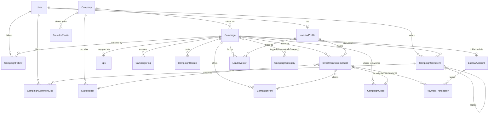

# Crowdfunding Database Design (Wefunder-style)

This document describes the database design that extends Captable's existing
cap-table schema into a full equity-crowdfunding platform in the style of
[Wefunder](https://wefunder.com) — public fundraising campaigns, small-check
investors, Reg CF compliance, escrow, rolling closes, SPVs, and community
features (comments, updates, perks, follows).

All models live in `prisma/schema.prisma` and were added by the
`add_crowdfunding_models` migration.

## Design principles

1. **Reuse, don't duplicate.** The platform already models companies,
   securities (`Safe`, `ConvertibleNote`, `Share`, `ShareClass`),
   stakeholders, e-signing (`Template`), documents, and billing. The
   crowdfunding layer sits *on top* of these: when a campaign closes,
   securities are issued through the existing cap-table models, keyed by
   `Stakeholder`.
2. **Money as `Decimal`.** All monetary columns use `Decimal(15,2)` (or
   larger for valuations) — never floats — so escrow balances reconcile
   exactly.
3. **Commitments are a state machine.** An investment is not a single event;
   it moves through `PENDING → PAYMENT_PROCESSING → ESCROWED → COMPLETED`
   with branches for cancellation, refunds, and Reg CF reconfirmation.
4. **Compliance is first-class.** KYC status, accreditation, Reg CF income /
   net-worth limits, Form C filing dates, 48-hour close notices, and
   educational-material acknowledgements all have dedicated columns rather
   than living in JSON blobs.
5. **Denormalized counters for hot paths.** `Campaign.amountCommitted`,
   `investorCount`, `CampaignComment.likeCount`, and `CampaignPerk.claimedCount`
   are maintained by application logic so the browse and pitch pages never
   need aggregate queries.

## Entity relationship diagram



## Model reference

### Investor identity & compliance

| Model | Purpose |
|---|---|
| `InvestorProfile` | One per `User`. Investing entity type (individual, LLC, trust, IRA), address, tokenized tax ID, self-reported income / net worth for the Reg CF annual limit, KYC status (`NOT_STARTED … APPROVED`), and accreditation status for Reg D deals. |
| `FounderProfile` | Team members displayed on a company's campaign page (name, title, bio, socials, display order). |

The Reg CF investment-limit calculation (based on `annualIncome` and
`netWorth`) is application logic; the profile stores the inputs and the
commitment stores the acknowledgements.

### Campaigns (the public raise)

| Model | Purpose |
|---|---|
| `Campaign` | The offering itself. Status lifecycle (`DRAFT → IN_REVIEW → TESTING_THE_WATERS → LIVE → FUNDED → CLOSED`, with `CANCELLED` / `FAILED` branches), regulation type (`REG_CF`, `REG_D_506B/C`, `REG_A_PLUS`), security type (`SAFE`, priced equity, note, revenue share, debt) with the relevant term fields (valuation cap, discount, price per share, interest, revenue-share cap), min/max goals, per-investor min/max, pitch content as structured JSON, schedule (`launchedAt`, `deadline`), and SEC Form C metadata. |
| `CampaignCategory` / `CampaignToCategory` | Browsable tags ("AI", "Fintech", …) for the explore page. |
| `CampaignPerk` | Reward tiers unlocked at a minimum investment amount, with optional quantity limits. |
| `CampaignFaq` | Founder-curated Q&A on the pitch page. |
| `CampaignUpdate` | Progress posts; `investorsOnly` hides an update from the public. (Distinct from the existing `Update` model, which is the company's private investor-update product.) |
| `CampaignComment` / `CampaignCommentLike` | Threaded public discussion ("Ask a Question"), with founder/investor badges, like counts, and soft deletion to preserve thread structure. |
| `CampaignFollow` | Watchlist; also stores a non-binding `indicatedAmount` during Testing-the-Waters. |
| `LeadInvestor` | Wefunder-style lead who writes the memo and may take carry in the SPV. |
| `Spv` | The special-purpose vehicle that pools small checks into a single cap-table line (legal name, EIN, jurisdiction, fees/carry). |

### Money movement

| Model | Purpose |
|---|---|
| `InvestmentCommitment` | The core transactional record: investor + campaign + amount + payment method + status machine. Snapshots the offering terms at commitment time (`termsSnapshot`) so a mid-campaign term change can trigger `RECONFIRMATION_REQUIRED` per Reg CF. Records regulatory acknowledgements, links to the e-sign envelope (`agreementTemplateId → Template`), and — once closed — to the `Stakeholder` under which securities were issued. |
| `EscrowAccount` | One per campaign; the account at the escrow agent holding funds while the raise is live, with a running balance. |
| `PaymentTransaction` | Immutable ledger rows against the escrow account: `CHARGE` (investor → escrow), `REFUND`, `DISBURSEMENT` (escrow → company), and `FEE`, with provider references for reconciliation. |
| `CampaignClose` | A rolling or final close. Reg CF permits disbursing in tranches once the minimum goal is met; each close records the 48-hour notice timestamp, the set of commitments included, gross amount, platform fee, and net disbursement. |

### Commitment lifecycle

```
PENDING ──▶ PAYMENT_PROCESSING ──▶ ESCROWED ──▶ COMPLETED (in a CampaignClose)
   │                │                  │
   │                │                  ├──▶ RECONFIRMATION_REQUIRED ──▶ ESCROWED | REFUNDED
   │                │                  │         (material change to offering)
   └──▶ CANCELLED   └──▶ CANCELLED     └──▶ REFUNDED (campaign FAILED / CANCELLED)
        (investor may cancel until 48h before a close)
```

On `COMPLETED`, the application issues the actual security through the
existing cap-table models:

- **SAFE campaigns** → a `Safe` row for the investor's (or the SPV's)
  `Stakeholder`.
- **Convertible note campaigns** → a `ConvertibleNote` row.
- **Priced rounds** → `Share` rows against a `ShareClass`.

When an SPV is used, only one `Stakeholder` (the SPV) appears on the
company's cap table; individual investors' economics stay inside the
crowdfunding tables.

### Key integrity rules (enforced in application logic)

- One `InvestorProfile` per `User`; one `EscrowAccount` and at most one
  `Spv` per `Campaign` (enforced by unique constraints).
- A commitment can only move to `PAYMENT_PROCESSING` if the investor's
  `kycStatus = APPROVED` and the amount is within their Reg CF limit
  (or `accreditationStatus = VERIFIED` for Reg D campaigns).
- `Campaign.amountCommitted / amountEscrowed / amountDisbursed`,
  `EscrowAccount.balance`, `CampaignPerk.claimedCount`, and
  `Campaign.investorCount` are updated transactionally with the
  corresponding `PaymentTransaction` / commitment status changes.
- A `CampaignClose` may only complete if `noticeSentAt` is at least 48 hours
  before `scheduledFor` (Reg CF rolling-close notice requirement).
